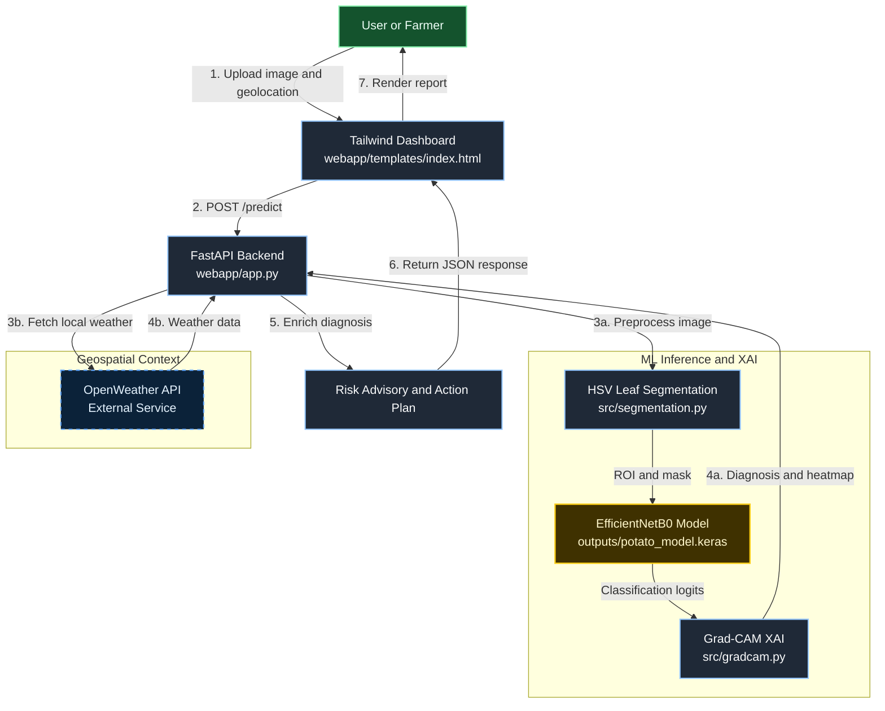

# Potato_disease: Intelligent Diagnostic & Risk Advisory System

An AI-powered precision agriculture platform built to help potato farmers in India detect foliar disease early, interpret model decisions, and act quickly with weather-aware risk advisory.

This project combines computer vision, explainable AI, and geospatial weather context to reduce crop-loss risk from **Early Blight** and **Late Blight**, while also identifying healthy plants.

## Academic Context

This work is developed as part of the **B.Tech AI/ML curriculum at RV College of Engineering (RVCE)** for EL (Engineering Liaison), Semester 2.

## Why This Matters

Potato disease progression is strongly influenced by local weather conditions (humidity, temperature, airflow). A generic image classifier is often not enough for field decisions. This system extends disease classification into a practical advisory engine by coupling:

- Leaf-level disease detection
- Explainability via Grad-CAM
- Real-time weather context via geolocation + OpenWeather API
- Structured class-specific action plans for intervention

## Technical Stack

- **Language**: Python 3.13
- **Backend/API**: FastAPI + Uvicorn (`webapp/app.py`)
- **ML Framework**: TensorFlow / Keras
- **CNN Backbone**: EfficientNetB0 (`src/model.py`)
- **Computer Vision**: OpenCV (HSV segmentation, image pre/post-processing)
- **Explainable AI**: Grad-CAM (`src/gradcam.py`)
- **Frontend**: Jinja2 template + Tailwind CSS dashboard (`webapp/templates/index.html`)
- **External Data**: OpenWeather API (weather-aware inference context)

## System Pipeline

The diagnosis flow is designed as a practical field pipeline:

1. **HSV-Based Leaf Segmentation** (`src/segmentation.py`)
2. **CNN Inference (EfficientNetB0-based model)** (`src/model.py` + loaded model in `webapp/app.py`)
3. **Grad-CAM Visualization for XAI** (`src/gradcam.py`)
4. **Risk and Advisory Enrichment** (weather + severity + treatment protocol logic in `webapp/app.py`)

### 1) HSV Leaf Segmentation

- Converts uploaded BGR image to HSV color space.
- Applies green-range thresholding (`lower_green` / `upper_green`) to isolate leaf tissue.
- Uses morphological open/close operations to denoise the mask.
- Extracts largest contour as leaf ROI.
- If segmentation fails (no contour), falls back to full image mask.

This gives robust preprocessing under non-lab image conditions and attempts to isolate the biologically relevant region.

### 2) CNN Inference

- Input resized to `224 x 224` and converted to RGB.
- Pixel scale intentionally kept in `[0, 255]` to match training preprocessing.
- Model outputs class probabilities for the v2 5-class pathogen-group classifier:
	- `Healthy`
	- `Fungi`
	- `Bacteria`
	- `Pest`
	- `Virus`

The canonical class list lives in `src/constants.py` and is the single source of truth for `src/dataset.py`, `src/model.py`, `src/train.py`, and `webapp/app.py`. See `outputs/dataset_report/manifest.json` for the v2 staging audit.

Note: `Early_Blight` and `Late_Blight` (the v1 potato-specific classes) were dropped in v2 because the only available training data for them is lab-domain (PlantVillage-style grey concrete backgrounds) which produced a fatal background-shortcut when mixed with the field-domain pathogen-group images. They are queued for v3 once field-domain blight data is sourced; placeholder entries remain commented out in `webapp/app.py` `DISEASE_INFO` and `TREATMENT_PROTOCOLS` for trivial restoration.

Architecture notes (`src/model.py`):

- EfficientNetB0 (`include_top=False`, ImageNet pretrained)
- Feature head: GAP -> BatchNorm -> Dense(256) -> Dropout(0.4) -> Dense(128) -> Dropout(0.3) -> Softmax
- Two-stage training pattern in `src/train.py`:
	- initial frozen-backbone training
	- controlled fine-tuning of final backbone layers

### 3) Grad-CAM Explainability

- Locates last convolution layer automatically (supports nested backbone structure).
- Computes class-specific gradients via `tf.GradientTape`.
- Produces normalized heatmap and resizes to input resolution.
- Overlays heatmap on original image for interpretability.

The output is returned in API response as `heatmap_url` and rendered in dashboard for trust-building and clinical-style diagnosis review.

## `/predict` Endpoint Deep-Dive

Primary API: `POST /predict`

### Request Inputs

- `file`: leaf image (`multipart/form-data`)
- `lat`: user latitude (from browser geolocation)
- `lon`: user longitude (from browser geolocation)

### Internal Decision Flow

1. Reads uploaded image to temporary path.
2. Runs segmentation and computes leaf-pixel quality gates.
3. Falls back to original image if segmentation confidence is low.
4. Runs model prediction and selects top class + confidence.
5. Generates Grad-CAM heatmap and computes severity percentage.
6. Fetches weather using OpenWeather (`temperature`, `humidity`, `wind_speed`, `sunlight_hours`).
7. Computes risk analytics (if non-healthy class):
	 - `risk_score` (0-10)
	 - `risk_level` (LOW / MEDIUM / HIGH)
	 - `spread_probability`
	 - `yield_impact`
	 - `treatment_urgency`
8. Maps predicted class to pathogen metadata and class-specific treatment protocols.
9. Returns structured diagnosis payload for dashboard rendering.

### Weather-Aware Risk Metrics

Risk is not based on class label alone. The service combines:

- Visual severity from Grad-CAM-activated regions
- Real-time humidity and temperature
- Derived spread probability and expected yield impact

This enables field-relevant advisories instead of static classification.

### Class-Specific Action Plans

The API returns `treatment_plan` with sections:

- `immediate`: immediate containment actions
- `chemical`: fungicide table with rate / interval / PHI
- `prevention`: long-term agronomic prevention strategy

For `Healthy`, severity/risk outputs are neutralized and treatment sections adapt accordingly.

## UI/UX Highlights

Frontend: `webapp/templates/index.html`

- Tailwind CSS powered diagnostics dashboard with responsive layout.
- Real-time pipeline status steps (segmentation -> classifier -> Grad-CAM -> risk -> report).
- Dynamic rendering of treatment protocols from API payload:
	- immediate action checklist
	- chemical treatment table
	- prevention cards
- Class-aware and severity-aware badges (diagnosis severity, urgency, risk visibility).
- Grad-CAM panel with side-by-side original specimen and heatmap.
- Weather context panel (temperature, humidity, wind, sunlight) tied to user geolocation.

## Project Structure

```text
.
|-- data/
|-- outputs/
|-- samples/
|-- src/
|   |-- segmentation.py
|   |-- model.py
|   |-- gradcam.py
|   |-- train.py
|   `-- predict.py
|-- webapp/
|   |-- app.py
|   |-- templates/index.html
|   `-- static/
|-- requirements.txt
`-- README.md
```

## Installation (Windows)

### 1. Clone and enter project

```powershell
git clone <your-repo-url>
cd Potato_disease
```

### 2. Create and activate virtual environment

```powershell
py -3.13 -m venv .venv
.\.venv\Scripts\Activate.ps1
```

If PowerShell blocks script execution:

```powershell
Set-ExecutionPolicy -Scope Process -ExecutionPolicy Bypass
```

### 3. Install dependencies

```powershell
pip install --upgrade pip
pip install -r requirements.txt
```

### 4. Configure OpenWeather API key

```powershell
setx OPENWEATHER_API_KEY "your_openweather_api_key_here"
```

Close and reopen terminal after `setx`, then verify:

```powershell
echo $env:OPENWEATHER_API_KEY
```

### 5. Run the FastAPI app

```powershell
python run.py
```

Alternatively, you can launch directly with uvicorn or by invoking the app module:

```powershell
python -m uvicorn webapp.app:app --host 127.0.0.1 --port 8000
# or
python webapp\app.py
```

Open: `http://127.0.0.1:8000`

## API Summary

- `GET /`: Dashboard UI
- `GET /weather?lat=..&lon=..`: Weather data fetch
- `POST /predict`: Full diagnosis + XAI + weather-aware advisory

## Model Artifacts

- Trained model paths (v2): `outputs/potato_model_v2.keras` (preferred) and `outputs/potato_model_v2.h5` (fallback). `webapp/app.py` tries `.keras` first and falls back to `.h5` automatically — see "Known Limitations" below for why both formats are saved.
- Grad-CAM output image: `webapp/static/gradcam_result.png` (regenerated per `/predict` call, not tracked in git).
- Segmented leaf preview: `webapp/static/segmented_leaf.png` (regenerated per `/predict` call, not tracked in git).

## Setup (v2)

**Python 3.11 is required.** TensorFlow 2.13 has no wheels for Python 3.13; using 3.13 will trip a `protobuf.runtime_version` import error.

```bash
# 1. Create a Python 3.11 venv at repo root
py -3.11 -m venv .venv
.\.venv\Scripts\Activate.ps1   # Windows PowerShell
# source .venv/bin/activate    # macOS/Linux

# 2. Install dependencies
pip install --upgrade pip
pip install -r requirements.txt

# 3. (Optional) Stage the dataset
python outputs/dataset_report/_stage_dataset_v2.py --proceed-no-supplement

# 4. Train the v2 model
python -m src.train

# 5. Configure OpenWeather API key
setx OPENWEATHER_API_KEY "your_key"   # Windows; reopen terminal after setx

# 6. Run the FastAPI app (canonical)
python run.py

# Alternatives:
# python -m uvicorn webapp.app:app --host 127.0.0.1 --port 8000
# python webapp\app.py
```

## Evaluation

Run the held-out validation set against the trained model:

```bash
python -m src.evaluate \
  --model_path outputs/potato_model_v2.h5 \
  --data_dir plant_dataset_staging/_val
```

This prints a per-class classification report, a confusion matrix, and writes `outputs/eval/confusion_matrix.png`.

## Known Limitations (v2.2.2)

- **Macro F1 = 0.74** on the v2 validation split (397 images across 5 classes).
- **Per-class F1**: Bacteria 0.91 (strongest), Fungi 0.74, Healthy 0.71, Pest 0.66, Virus 0.66 (weakest).
- **Virus recall is only 51%** — viral foliar symptoms overlap visually with other pathogen groups; this is the class most likely to be misdiagnosed in the field. Treat virus predictions with extra skepticism and confirm via lab (ELISA / PCR).
- **`Early_Blight` and `Late_Blight` are not detected by v2.** They are queued for v3 once field-domain blight training data is sourced. The v1 lab-domain potato images were dropped because mixing them with the field-domain v2 images produced a fatal background-shortcut.
- **Healthy is the smallest class** (199 images, vs Fungi 743). Class weights and augmentation partially compensate, but Healthy recall benefits most from additional field-shot supplementary data — see `outputs/dataset_report/manifest.json` `v2_1_followup_note`.
- **Keras 2.13 `.keras` deserialization bug**: the native `.keras` saved model fails to load with a `Layer 'normalization' expected 3 variables, but received 0` error due to a known issue with EfficientNet's internal `Normalization` layer state. `src/train.py` therefore saves both `.keras` (preferred) and `.h5` (fallback) on every run, and `webapp/app.py` tries `.keras` first then falls back to `.h5` automatically. Do not delete the `.h5` file.
- **DISEASE_INFO entries for Fungi / Bacteria / Pest / Virus are generic placeholders** (e.g., "Fungal pathogen group — specific species identification requires laboratory confirmation"). They do not name specific pathogens. v3 should refine these with field-validated species when available.

## High-Level Architecture Diagram



## Production Readiness Notes

- Explicit invalid-image and low-confidence handling.
- Segmentation quality checks with fallback behavior.
- Timezone-aware diagnosis timestamping (`Asia/Kolkata`).
- Consistent, structured JSON payload for frontend rendering.
- Explainability artifact generation for decision transparency.

## Contributing

Contributions are welcome and encouraged.

1. Fork the repository.
2. Create a feature branch: `git checkout -b feature/your-feature-name`.
3. Make changes with clear commits.
4. Add or update tests/documentation where relevant.
5. Open a Pull Request with:
	 - problem statement
	 - design summary
	 - screenshots/API samples (if UI/API changes)

Recommended contribution areas:

- Model calibration and confidence reliability
- Additional potato disease classes and localization
- Offline weather fallback strategy
- Evaluation dashboards and experiment tracking
- CI/CD, containerization, and deployment hardening

## Disclaimer

This system provides decision support and not a substitute for expert agronomist consultation. Chemical recommendations should be validated against local agricultural regulations and extension guidelines.

## Acknowledgment

Developed for academic and practical impact in Indian agriculture under the RVCE AI/ML learning track.

Developed by Medhansh Pratap Singh
Github Handle - Singhmedhansh